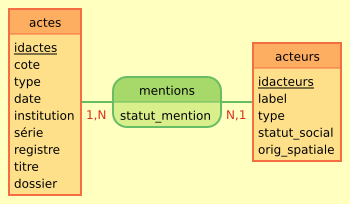

Séance du 08/11/23 Programe  : 
1) Reprise des éléments de la séance 1 et amélioration
2)TD Tropy vers Base de Donnée 

***nb: ! + [***]+ (chemin) pour insérer une image dans GITHUB***

# Organiser ses sources avec Tropy

  Tropy utilise des modèles de métadonnées personnalisables avec différents espaces pour chaque détail du contenu, comme le titre, la date, l'auteur, la boîte, le dossier, la collection, et l'archive. Il est possible d'ajouter ou de changer ces informations pour une seule photo ou plusieurs.

Tropy fournit un moyen de créer des métadonnées structurées sur nos sources et de les exporter sous divers formats (.CSV, JSON LD, .ZIP, etc.). En revanche pour le format .CSV il faut télécharger le plugin depuis GitHub. Ensuite, l'installer dans Tropy (accédez à Préférences> Plugins (sous Windows, Edition>Préférences> Plugins).

Tropy nous permet également d'importer des images directement depuis un navigateur Web ainsi que les fichiers JSON-LD

## Les enjeux de la création d'un modèle de saisie pour décrire des documents dans Tropy

Ouverture du fichier projet_documents_diplomatiques.tropy.zip et manipulation en classe...

Nous avons importé le documents dans Tropy pour but de décrire de manière organisée et complète ----> le modèle de saisie. En effet, comme on l'a vue, Tropy permet une personnalisation des modèles de métadonnées ce qui signifie qu'on peutadapter les champs en fonction des besoins spécifiques de notre collection de documents. En renseigannt ou modifiant des champs tels que le titre du document, la date, l'auteur, le lieu, la boîte de stockage, le dossier, la collection...etc avec la possibilités de  modifier ou de supprimer des champs en fonction de la nature de des documents et des besoins de la description.

Tropy s'appuie sur des standars de métadonnées
  un standard :  modèle prexistant pour les métadonnées --> permettre la circulation des informations entre plusieurs BDD, logiciels, modeles de données...etc.  C'est une contribution à l'open access ----> ce qui s'appelle l'intéropérabilité* 

Ontologie en informatique c'est la maniere de decrire de facon structurée l'information sur un domaine particulier. Cet aspect va être aborder + en détail lors du second semestre, l'obj du cours est d'associer cette métadonnée à des ontologies. 

...Parmis ces associations, on peu citer le plus connu, le Dublin Core (1995 à Dublin (USA)) pour répondre à un besoin du gouvernement afin de faire circuler les informations --> initialement penser par des conservateurs de bibliothèque, et également des historien. C'est donc un sensemble de métadonnées standardisé utilisé pour décrire des ressources numériques telles que des documents, des images, des vidéos, etc. Il fournit un ensemble de termes (éléments) et de qualificatifs (termes secondaires) pour décrire les caractéristiques essentielles d'une ressource, facilitant ainsi la recherche, la gestion et l'échange d'informations sur ces ressources sur le web.
  Le Dublin Core comprend 15 éléments de base qui peuvent être utilisés pour décrire divers aspects d'une ressource, notamment le titre, le créateur, le sujet, la description, l'éditeur, la date, le format, le type de ressource, la langue, etc. Ces éléments offrent une flexibilité pour décrire une large gamme de ressources numériques..
  
Critique : Dublin Core jugée trop générique, trop universel. On a ainsi créer un modele de saisie. 

## Tropy et les limites de l'approche documentaire

# De tropy à la base de données heuristique

